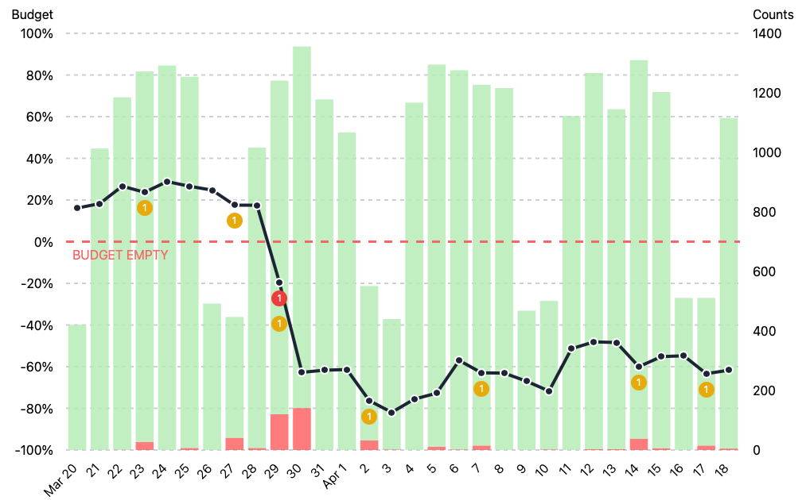

Example of an accessible chart.

[Demo](https://jakzo.github.io/slo-chart/)

## Why is this chart better than other charts?

- Individual days can be selected and read by screen readers
  - Pressing TAB allows selecting a day or clicking with the mouse
- The chart is SSR compatible and will render even if JS is disabled
  - Everything works with JS disabled except for the tooltip on hover
- Responsive design
  - Resizing the window will cause the chart to resize with no loss in quality
  - It is even responsive when JS is disabled!
- Animation which respects `prefer-reduced-motion`
  - If the user has this OS preference set then the bars and line will fade in instead of moving on load
- Dark theme based on `prefers-color-scheme`
  - Chooses between dark and light theme based on OS preference
